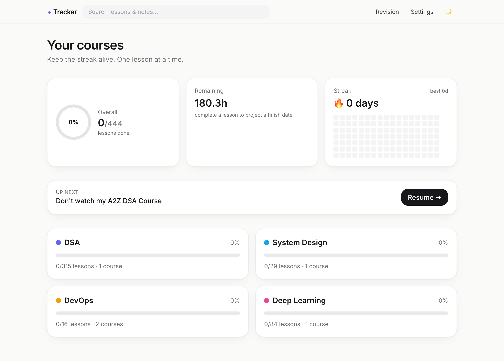
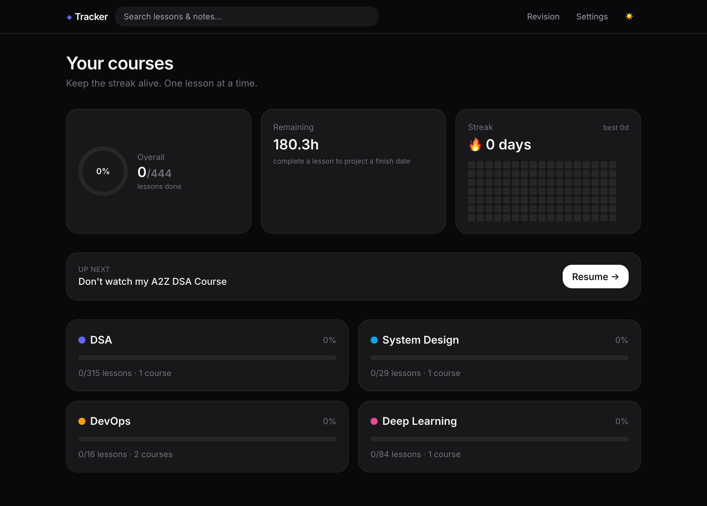
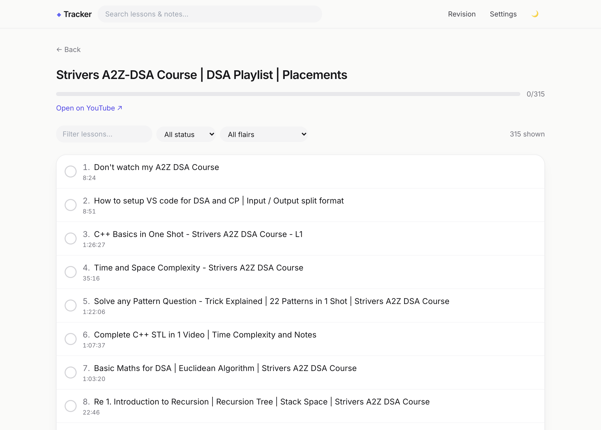
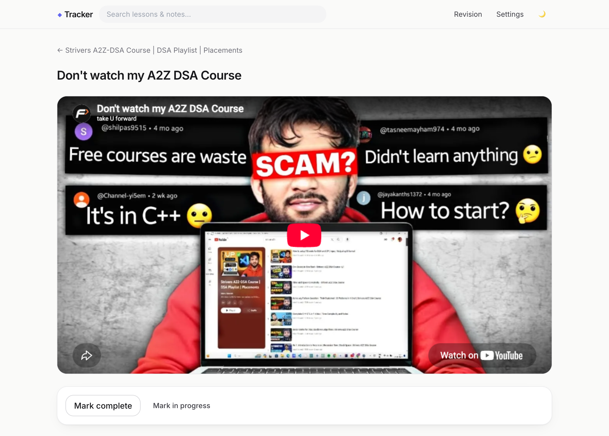
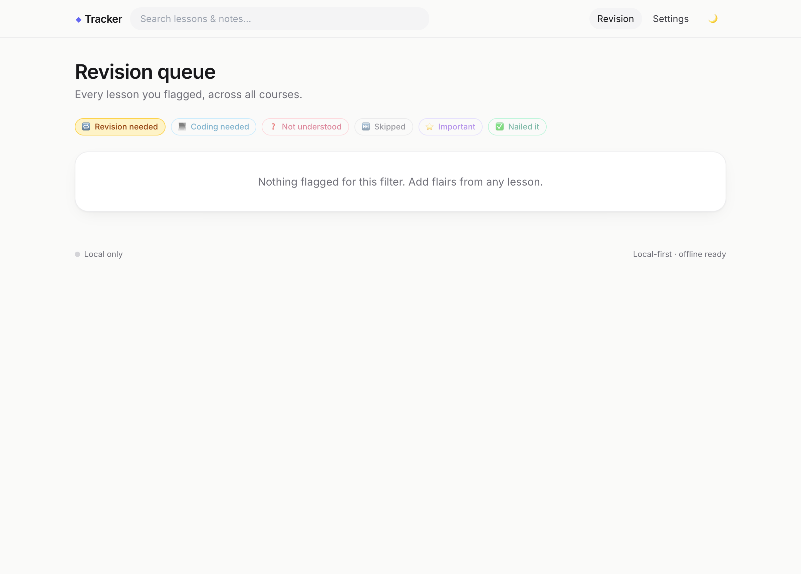
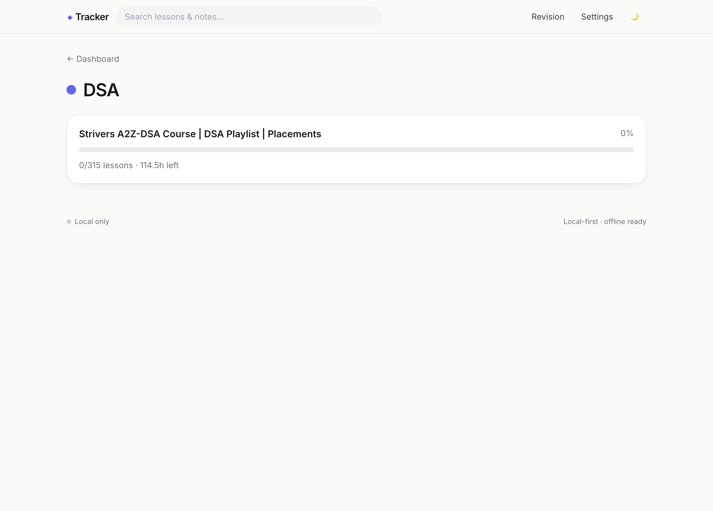

<div align="center">

# ◆ TrackBack

**A calm, local-first tracker for the YouTube courses you're actually working through.**

Lesson-by-lesson progress · notes · image + voice attachments · flair tags · streaks — all offline,
with optional background sync across devices.

[](https://github.com/SAQLAINAP/TrackBack/releases/latest)
[](https://github.com/SAQLAINAP/TrackBack/actions/workflows/android.yml)



</div>

---

## 📱 Get the app

**Android:** grab the latest APK from the [**Releases page**](https://github.com/SAQLAINAP/TrackBack/releases/latest) →
download `TrackBack-*.apk`, open it on your phone, and install (allow *"install from unknown sources"* once).

**Web / install as PWA:** run it locally (see [Development](#-development)) and use *Install app* from your
browser — it works fully offline and adds an icon to your home screen / dock.

> The app is **local-first**: everything works with **no account and no network**. Sign-in and cross-device
> sync are an optional layer you can switch on later.

---

## ✨ Features

- **Four course tracks, 444 lessons, seeded in** — DSA (315), System Design (29), DevOps (16), Deep Learning (84).
- **Lesson-by-lesson progress** — mark complete manually **or** let the embedded player auto-complete on video end. Both auto-stamp the completion date.
- **Rich per-lesson capture** — markdown **notes** (code-friendly), **image uploads** with a gallery, and **voice memos** via the mic.
- **Flair tags** — flag any lesson as *revision needed · coding needed · not understood · skipped · important · nailed it*.
- **Revision queue** — a cross-course view of everything you've flagged, filterable by flair.
- **Analytics** — overall completion ring, **study-streak heatmap**, remaining-hours estimate with a projected finish date, and an "Up Next" resume card.
- **Global search** across lesson titles and your notes.
- **Offline-first & installable** — IndexedDB is the source of truth; a service worker makes it a real PWA.
- **Optional sync** — email/password auth + background Last-Write-Wins sync via Supabase (Postgres + Storage).
- **Dark / light theme** and full **JSON + media backup** export / import.

---

## 🖼️ Screenshots

|  |  |
|---|---|
| **Dashboard** — rings, streak, up-next<br> | **Dark mode**<br> |
| **Course** — lessons, filters, search<br> | **Lesson** — embedded player + completion<br> |
| **Revision queue** — flag-filtered<br> | **Section** — course progress<br> |

---

## 🧱 Tech stack

| Area | Choice |
|---|---|
| App | **Vite + React + TypeScript** |
| Styling / motion | **Tailwind CSS** · **Framer Motion** |
| Local data | **Dexie (IndexedDB)** + `dexie-react-hooks` |
| PWA | **vite-plugin-pwa** (manifest + service worker) |
| Sync (optional) | **Supabase** — Auth, Postgres, Storage |
| Player | **react-youtube** (IFrame API, auto-complete on end) |
| Media | **MediaRecorder** (voice) · file input (images) |
| Android shell | **Capacitor 8** → native APK (Android 16 / SDK 36) |

---

## 🚀 Development

```bash
npm install
npm run dev        # http://localhost:5175
npm run build      # type-check + production build (also generates the PWA service worker)
```

No environment variables are needed — the app runs 100% locally out of the box.

---

## 🤖 Building the Android APK (no local Android toolchain)

The APK is built **in the cloud** by GitHub Actions — you don't need Android Studio, a JDK, or the
Android SDK on your machine.

1. Push to `main` (or trigger **Build Android APK** manually from the **Actions** tab).
2. The workflow runs: `npm ci` → `npm run build` → `cap sync android` → `gradlew assembleDebug`.
3. Download the APK from the run's **Artifacts**, or from the **[Releases](https://github.com/SAQLAINAP/TrackBack/releases)** page.

The build is **debug-signed** — perfect for personal sideloading. For Play Store distribution you'd add a
release keystore via encrypted GitHub Secrets.

Local Capacitor workflow (if you *do* have Android Studio):

```bash
npm run build
npx cap sync android
npx cap open android
```

---

## ☁️ Optional: enable cross-device sync

The app is fully functional without this. To turn on account-based sync:

1. Create a free **Supabase** project.
2. Run [`supabase-schema.sql`](supabase-schema.sql) in the SQL editor (creates tables, RLS policies, and the private `media` storage bucket).
3. Copy `.env.example` → `.env.local` and fill in:
   ```
   VITE_SUPABASE_URL=your-project-url
   VITE_SUPABASE_ANON_KEY=your-anon-key
   ```
4. To bake sync into the **APK build**, add those two values as repository **Secrets** (Settings → Secrets → Actions) — the workflow already reads them.

Sync is **Last-Write-Wins** on `updatedAt`; media blobs are uploaded to Supabase Storage and lazy-downloaded on other devices.

---

## 🗂️ Project structure

```
src/
  data/seed.ts        # bundled course/lesson seed (444 lessons)
  lib/                # db (Dexie), repo, sync, queries, auth, backup, theme, format
  components/         # UI kit, sync badge, streak heatmap, notes editor, voice recorder, media gallery
  pages/              # Dashboard, Section, Course, Lesson, Revision, Search, Settings
android/              # Capacitor Android project (generated)
.github/workflows/    # android.yml — cloud APK build
```

---

## 🔒 Privacy & data

Your progress, notes, images, and voice memos live **on your device** in IndexedDB. Nothing leaves the
device unless you explicitly configure Supabase sign-in. The `.gitignore` is hardened to keep credentials,
keystores, and `.env` files out of the repository.

---

<div align="center">
<sub>Built for focused, offline-friendly learning. One lesson at a time.</sub>
</div>
